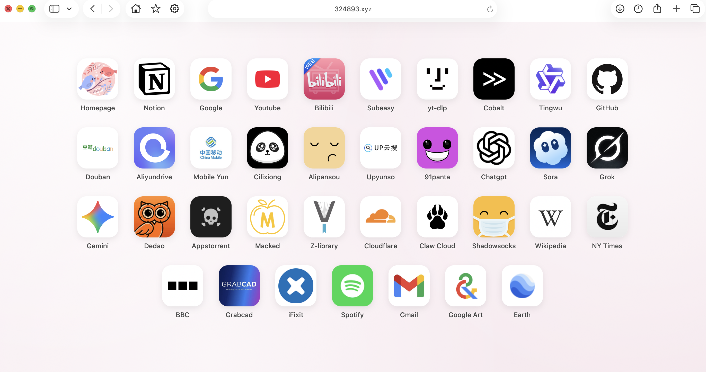

# # 🧭 My Homepage (Personal Start Page)

一个极简、美观且功能强大的浏览器起始页，采用仿 iOS 的毛玻璃与圆角设计风格。支持拖拽排序、自定义图标、多源图标自动获取以及主题切换。

纯静态 HTML/CSS/JS 实现，无需后端，部署在 GitHub Pages 即可使用。


*(建议：你可以在这里放一张网页的截图，文件名为 preview.png 上传到仓库根目录)*

## ✨ 主要功能 (Features)

* **🎨 仿 iOS 设计**：精美的毛玻璃背景、圆角卡片、平滑的交互动画。
* **🖱️ 拖拽排序**：长按右下角编辑按钮进入编辑模式，支持任意拖拽改变图标顺序（基于 SortableJS）。
* **✏️ 可视化编辑**：
    * 支持添加、删除、修改书签。
    * **自动获取图标**：输入网址自动从 Manifest, Brandfetch, Logo.dev 等多个源获取高清图标。
    * **随机图标生成**：内置 DiceBear API，支持生成几何、像素、表情等多种风格的随机头像。
    * **实时预览**：修改过程中可实时看到图标和标题效果。
* **💾 数据管理**：
    * 支持导出配置为 `bookmarks.json`。
    * 数据纯前端处理，通过替换 GitHub 仓库中的 JSON 文件即可同步更新。
* **🎨 主题切换**：内置 5 种马卡龙色系背景，点击底部色块即可一键切换并保存偏好。
* **📱 移动端适配**：
    * 完美支持 PWA（Add to Home Screen）。
    * 添加到 iPhone/iPad 桌面后支持全屏沉浸式显示，拥有独立 App 图标。

## 🚀 快速开始 (Getting Started)

### 1. 部署到 GitHub Pages

1.  **Fork** 本仓库到你的 GitHub 账号。
2.  进入仓库的 **Settings** -> **Pages**。
3.  在 **Build and deployment** 下，将 **Branch** 设置为 `main` (或 `master`)，保存。
4.  等待几分钟，GitHub 会生成你的专属链接，例如：`https://你的用户名.github.io/Homepage/`。

### 2. 修改配置

有两种方式更新你的书签：

**方式 A：通过网页操作 (推荐)**
1.  打开你的网页，点击右下角的 **编辑按钮**。
2.  添加或修改完书签后，点击 **"导出配置"**。
3.  下载 `bookmarks.json` 文件。
4.  将此文件上传到你的 GitHub 仓库根目录，覆盖原文件。

**方式 B：手动修改代码**
直接编辑仓库中的 `bookmarks.json` 文件，格式如下：

```json
[
  {
    "title": "GitHub",
    "url": "[https://github.com](https://github.com)",
    "icon": "[https://manifest.im/icon/github.com](https://manifest.im/icon/github.com)",
    "style": "white" 
  },
  {
    "title": "Bilibili",
    "url": "[https://www.bilibili.com](https://www.bilibili.com)",
    "icon": "[https://manifest.im/icon/bilibili.com](https://manifest.im/icon/bilibili.com)",
    "style": "fit"
  }
]
